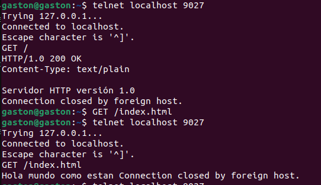
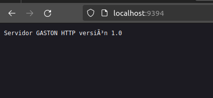
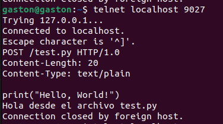

# Unix_Project

# GET

Para ejecutar el GET y poder leer el contenido de cualquier archivo solo debe hacer lo siguiente

### paso 1:

Ejecutar el programa puede hacerlo con ./http_server "puerto del servidor"
donde debe especificar a que puerto estara abierto ejemplo : ./http_server 9027

## paso 2:

Puede abrir la terminal y correr el siguiente comando :
telnet localhost "puerto de coneccion ", donde debe especificar a que puerto se conectara por ejemplo : telnet localhost 9027 

## paso 3:

Finalmente solo escribir GET / o GET/index.html , para leer el contenido del archivo.

# POST

### paso 1:

Ejecutar el programa puede hacerlo con ./http_server "puerto del servidor"
donde debe especificar a que puerto estara abierto ejemplo : ./http_server 9027

## paso 2:

Puede abrir la terminal y correr el siguiente comando :
telnet localhost "puerto de coneccion ", donde debe especificar a que puerto se conectara por ejemplo : telnet localhost 9027 

## paso 3:

Para ejecutar un post para ejecutar un archivo .py debe escribir lo siguiente por ejemplo: 
POST /test.py HTTP/1.0
Content-Length: 20
Content-Type: text/plain

print("Hello, World!")

